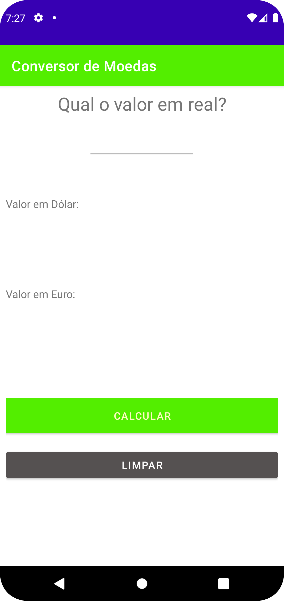
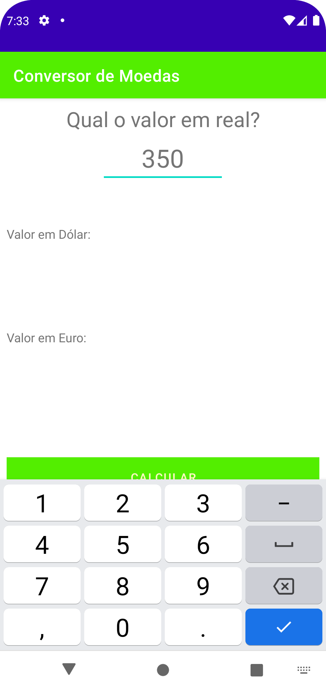
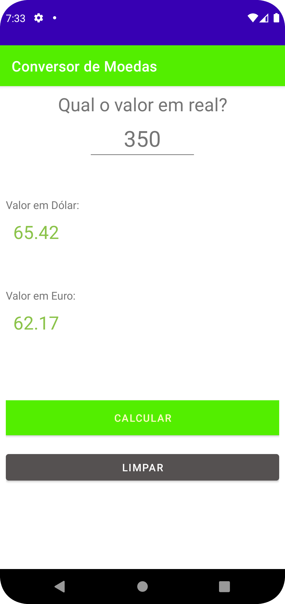

<h1 align="center">Conversor de Moedas</h1>

  
  

  

⭐ Esse é um projeto para demonstrar meu conhecimento técnico no desenvolvimento Android nativo com Java. Mais informações técnicas abaixo.

🎥 Aplicativo recebe um valor no imput que faz uma conversão em Dólar e Euro e exibe em tela esse dois valores.

 

## Download

faça o download da <a href="https://github.com/HeitorPreviero/ConversorMoedas/blob/main/apk/v1.apk?raw=true">APK diretamente</a>. Você pode ver <a href="https://www.google.com/search?q=como+instalar+um+apk+no+android">aqui</a> como instalar uma APK no seu aparelho android.

## Tecnologias usadas 

- Minimum SDK level 19
- [Linguagem Java 8](https://www.java.com/pt-BR/) 
 
## Features

### Feature 1

Texto de exemplo

